## 1. Start and Stop a Virtual Machine
- #### GCP:
    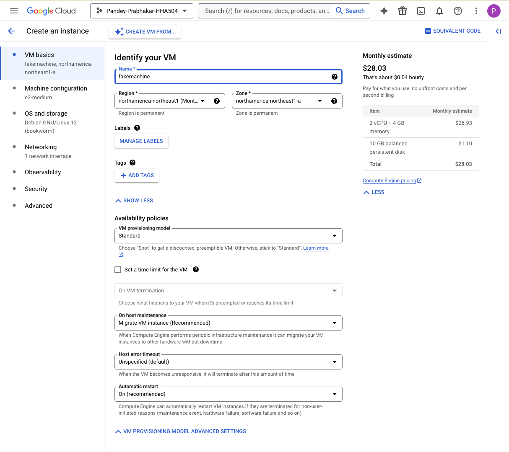
    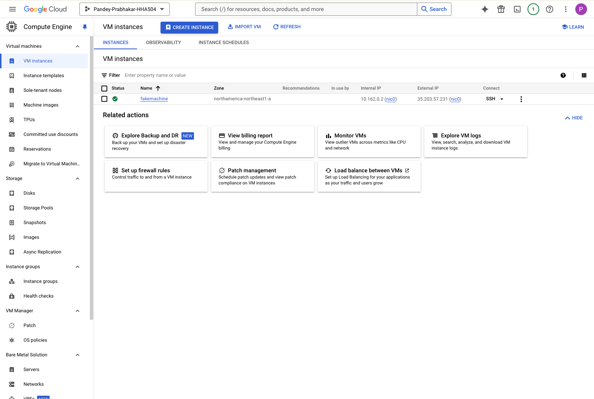
    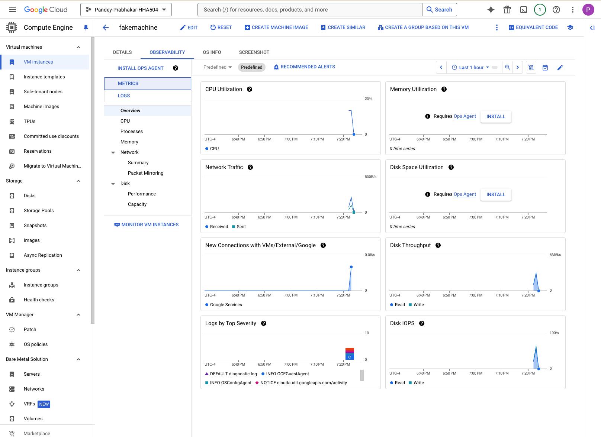

- #### Azure:
    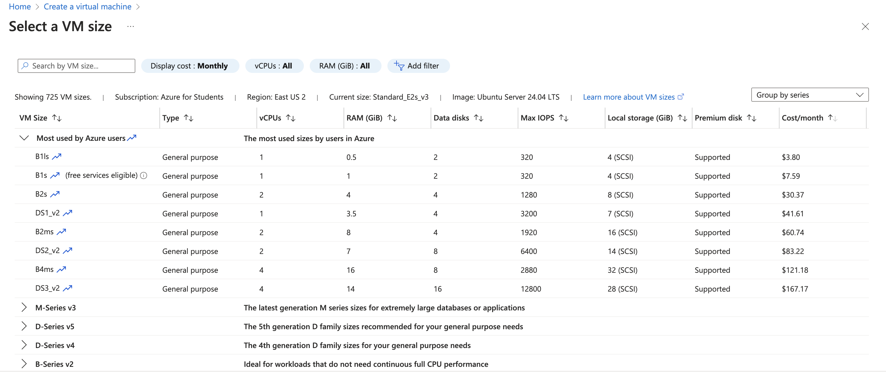
    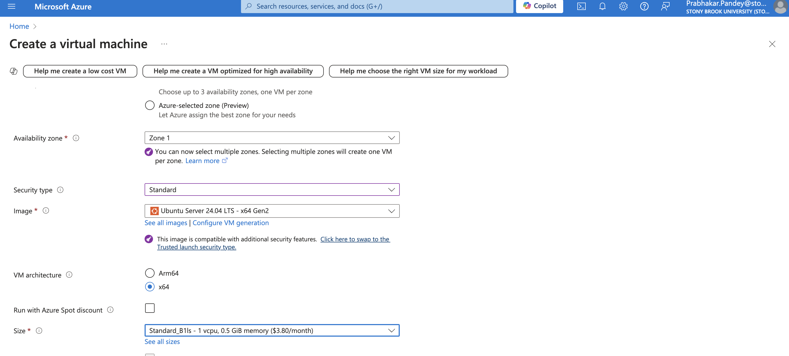
    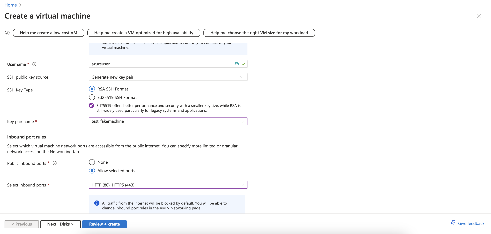
    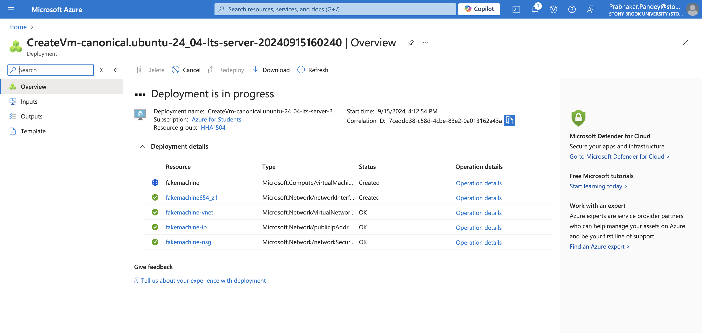

## 2. Monitor VM Costs

- #### Azure: 
    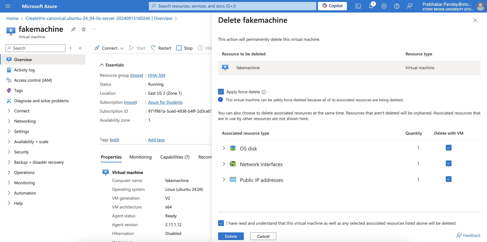
    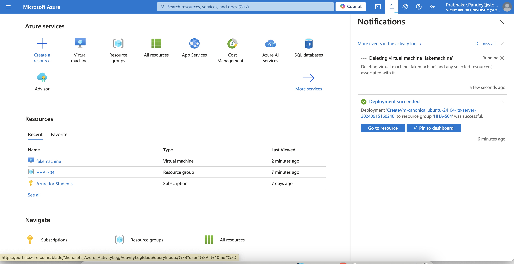

- #### GCP: 
    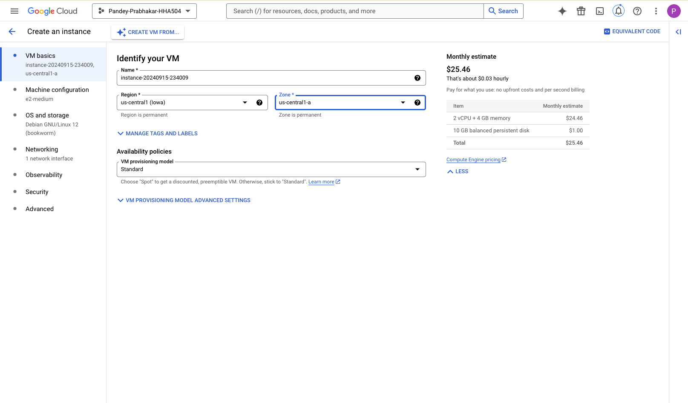
    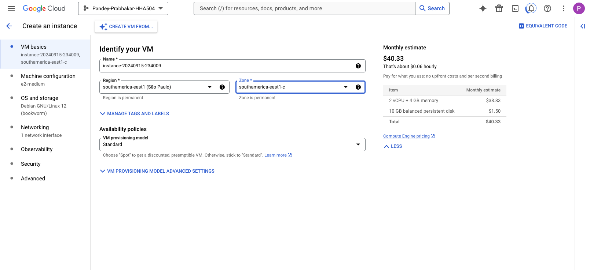
    
> Comparison

Both platforms had a wide range of VM instances. Pricing varied based on region or zone. It was difficult to find sizes for Virtual Machines. Changing regions populated various sizes. 

The cost saving options/billing section was easier to navigate in GCP. Azure's UI felt a bit crowded. GCP was more intuitive. When going through different sizes, Azure had cheap options for various sizes. GCP looks simple and transparent whereas Azure seems to have a lot of bells and whistles.
